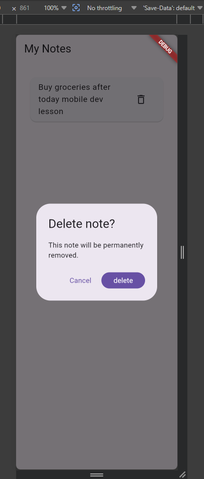

# Confirm Alert Widget

This widget is a reusable Flutter confirmation dialog that asks the user to be sure before an action that might be destructive. 'My Notes' app shows how deleting a note requires explicit approval.

Screenshot


Run Instructions
1. Prerequisites: [Flutter SDK](https://docs.flutter.dev/get-started/install) installed and on your `PATH`.
2. Clone this repository and open the project folder.
3. Install dependencies to use, is;
   ```bash 
   flutter pub get
   ```

4. Run the app; 
   ```bash
    flutter run 
    ``` 
5. Tap the trash icon on a note to open the confirm alert. You can always Choose 'Cancel' to keep the note or 'delete' to remove it.
The now, to run tests; Use the following ways.
    
    ```bash
     flutter test
     ```

The Three Attributes;

1. `confirmLabel` (String, default: "Confirm") This is implemented to set the text on the primary action button. Changed to "Delete" in this demo so the button label matches the destructive action rather than showing a generic word.
2. `cancelLabel` (String, default: "Cancel") This attribute sets the text on the dismiss button. A developer might change this to "Keep note" to make the safe option more explicit for the user.
3. `barrierDismissible` (bool, default: false) — controls whether tapping outside the dialog closes it. Set to false so the user must make a conscious choice; changing it to true lets the dialog close without confirming, which risks accidental dismissal on a destructive action.


Project Structure

lib/
|__ main.dart  // My notes demo screen
|__ widgets/
    |__confirm_alert.dart  // Reusable showConfirmAlert function.


Presentation
In-class presentation date: June 9, 2026